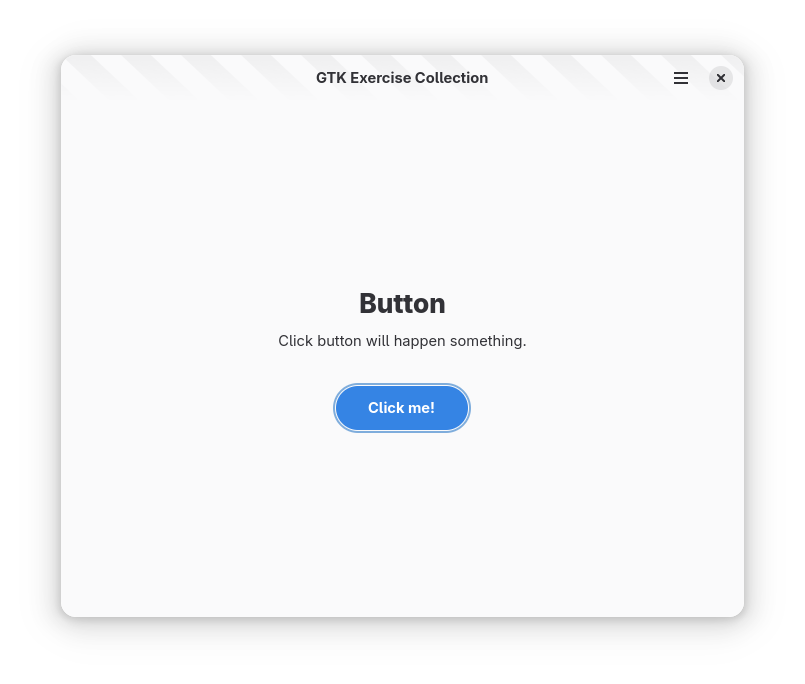

# 你好，按钮

## 软件需求

1. 根据模板创建项目
2. 在窗口正中央显示一个按钮
3. 按钮颜色为蓝色，椭圆片状，上下左右居中对齐
4. 点击按钮触发事件：
    - 终端输出 INFO
    - 按键标签修改为「You do it!」

## Screenshots

## Template

The template fork from [GTK Rust Template](https://gitlab.gnome.org/World/Rust/gtk-rust-template). Changed for support Adwaita theme.
