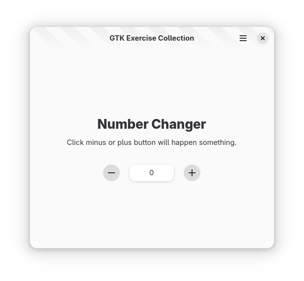

# 你好，按钮

## 软件需求

1. 根据模板创建项目
2. 在窗口正中央显示两个按钮和一个标签
3. 两个按钮样式为 `circular` 和 `opaque`，左右居中对齐，分别显示加号 `list-add-symbolic` 和减号 `list-remove-symbolic` 图标
4. 两个按钮之间显示标签，标签使用 `card` 样式
5. 标签默认内容为数字零，点击减号按钮更新标签结果减一；加号按钮相反
6. 点击按钮触发事件：
    - 终端输出 INFO
    - 标签根据按钮作用显示对应结果

- 尝试在模板代码中将标签默认值设置为非数值类型，并处理异常情况

## Screenshots

## Template

The [template](../template/) fork from [GTK Rust Template](https://gitlab.gnome.org/World/Rust/gtk-rust-template). Changed for support Adwaita theme.
