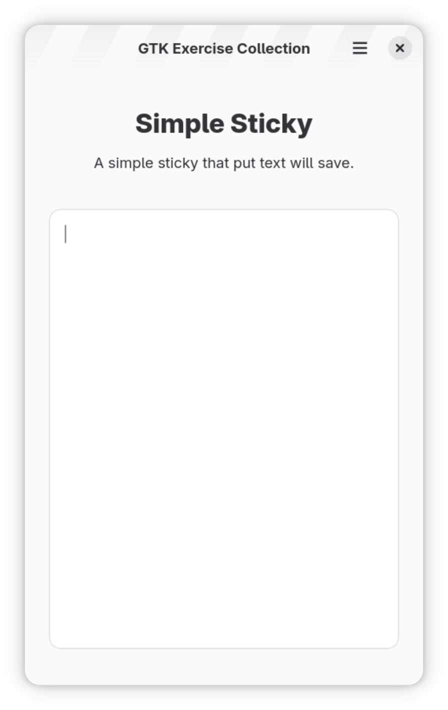

# 简易便签

## 软件需求

1. 根据模板创建项目
2. 在窗口正中央显示一个文本输入域
3. 拆分主窗口与页面内容，编写自定义组件，通过 Rust 代码在运行时创建文本输入域，而不是直接在 window.blp 中添加
4. 文本输入域自动换行，不拆分单词，启用垂直滚动，禁用水平滚动
5. 运行程序时加载 gschema.xml 中上次保留的文本内容，关闭程序时保存文本域中的内容到 gschema.xml

## Screenshots

## Template

The [template](../template/) fork from [GTK Rust Template](https://gitlab.gnome.org/World/Rust/gtk-rust-template). Changed for support Adwaita theme.
