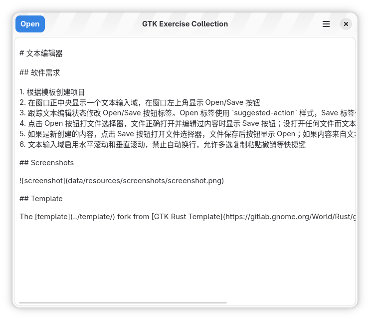

# 文本编辑器

## 软件需求

1. 根据模板创建项目
2. 在窗口正中央显示一个文本输入域，在窗口左上角显示 Open/Save 按钮
3. 跟踪文本编辑状态修改 Open/Save 按钮标签。Open 标签使用 `suggested-action` 样式，Save 标签使用 `destructive-action` 样式
4. 点击 Open 按钮打文件选择器，文件正确打开并编辑过内容时显示 Save 按钮；没打开任何文件而文本区域内容不为空时按钮显示 Save 按钮
5. 如果是新创建的内容，点击 Save 按钮打开文件选择器，文件保存后按钮显示 Open；如果内容来自文本，点击 Save 按钮后显示 Open
6. 文本输入域启用水平滚动和垂直滚动，禁止自动换行，允许多选复制粘贴撤销等快捷键

## Screenshots

## Template

The [template](../template/) fork from [GTK Rust Template](https://gitlab.gnome.org/World/Rust/gtk-rust-template). Changed for support Adwaita theme.
